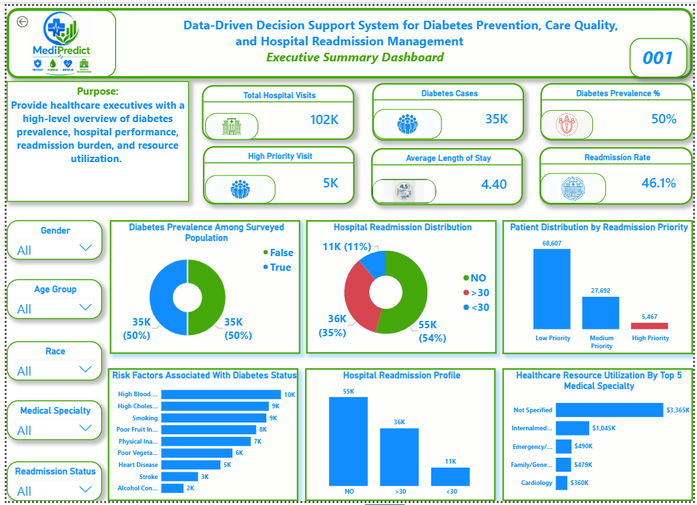
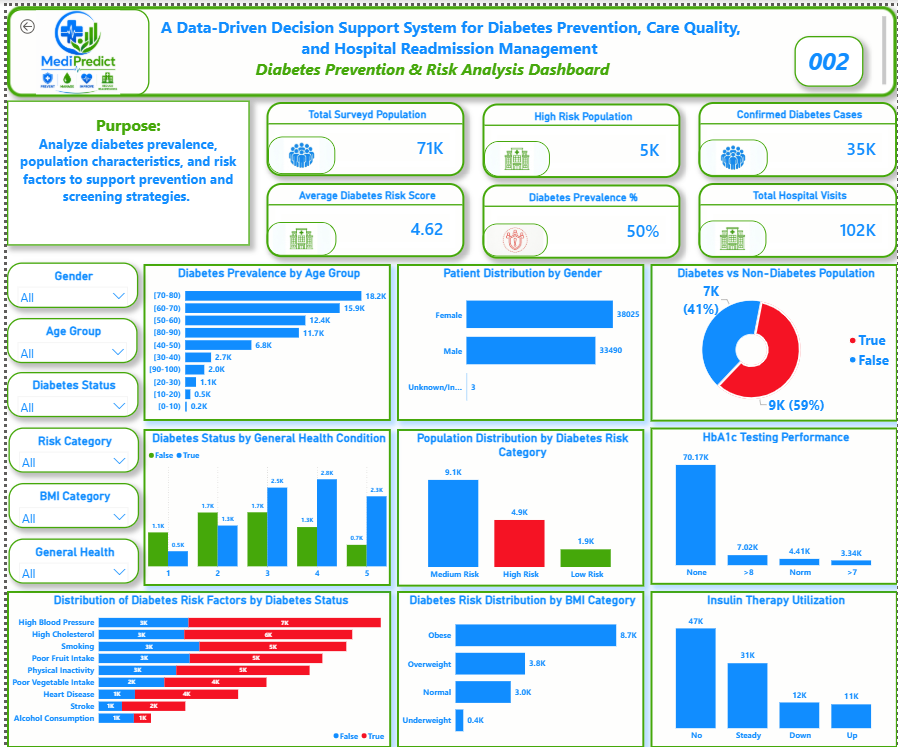
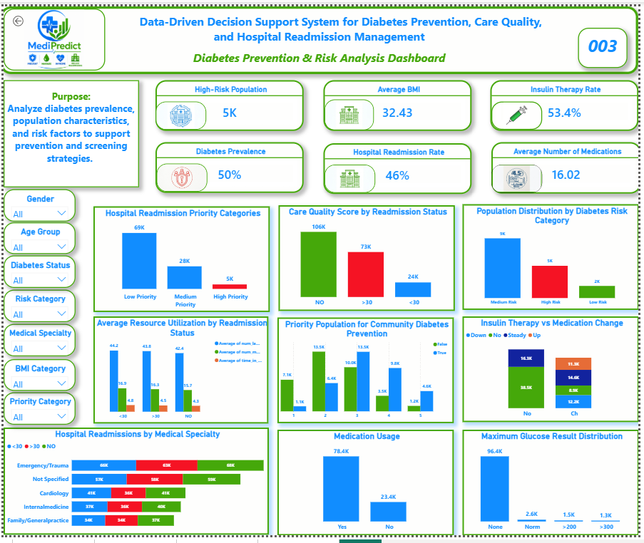
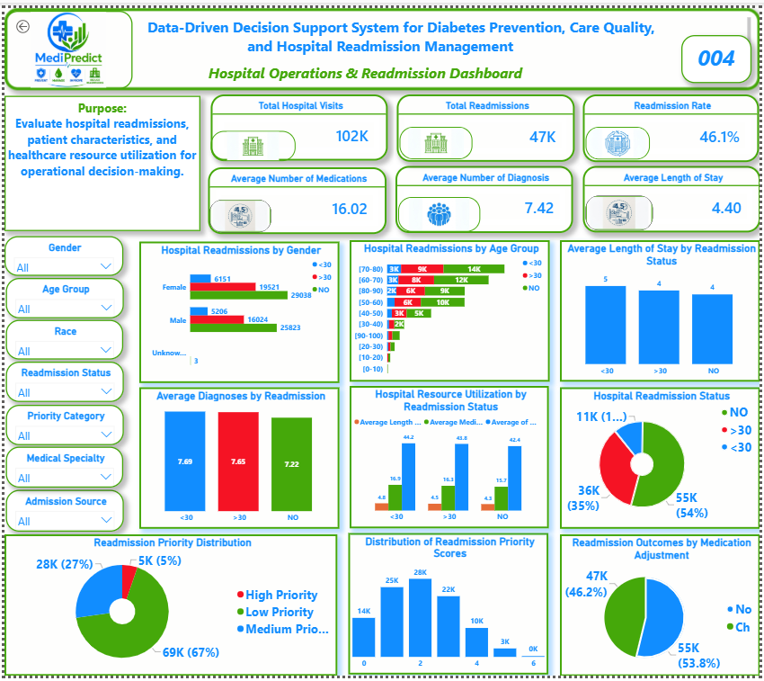
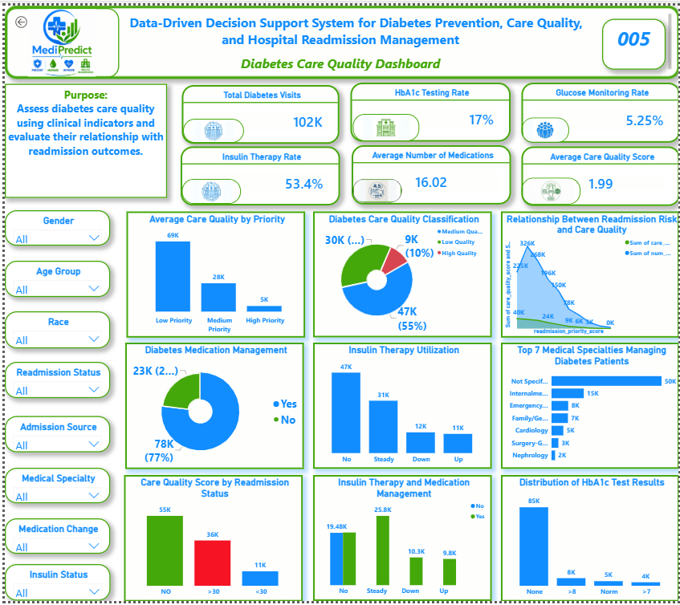
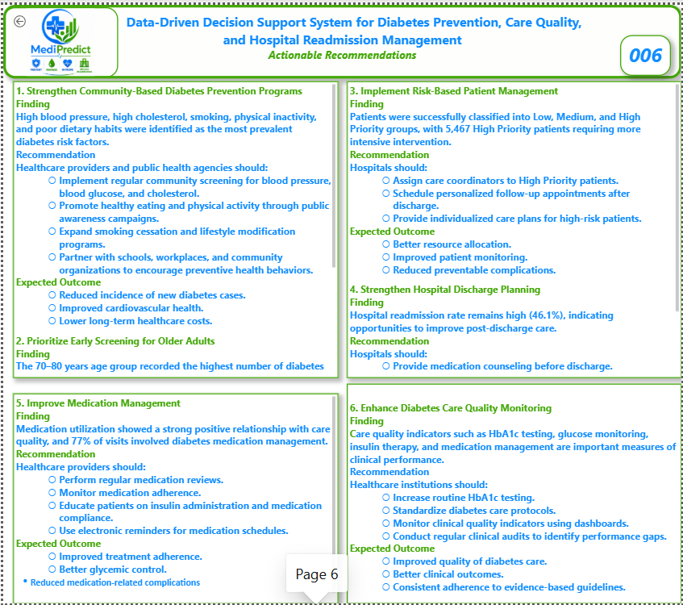

# Power BI Dashboard Screenshots

This folder contains screenshots of the **Diabetes Healthcare Decision Support System** Power BI dashboards.

The screenshots provide a visual overview of the project's healthcare analytics, including diabetes prevention, population risk, hospital readmission, care quality, and decision-support insights.

## Dashboard Screenshots

### Executive Summary

Provides an overview of key healthcare performance indicators, including hospital visits, readmissions, diabetes prevalence, and healthcare utilization.

### Diabetes Prevention & Risk Analysis

Highlights diabetes prevalence, major risk factors, population characteristics, and prevention priorities.

### Population Risk Segmentation

Shows the distribution of patients or populations across different diabetes risk categories and identifies groups requiring greater prevention attention.

### Hospital Operations & Readmission

Analyzes hospital utilization, length of stay, emergency and inpatient activity, and readmission patterns.

### Diabetes Care Quality

Examines HbA1c testing, insulin therapy, medication management, and other indicators of diabetes care quality.

### Actionable Recommendations

Summarizes the major findings and translates the analysis into practical healthcare and operational recommendations.

---

## Files

The screenshots in this folder correspond to the Power BI dashboard pages available in the parent `power_bi` folder.

For the complete interactive dashboard, see:

**`power_bi/diabetes_dashboard.pbix`**
